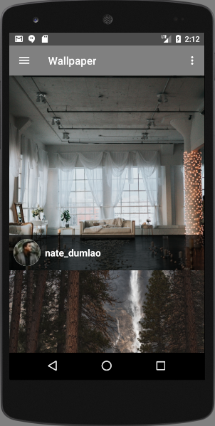
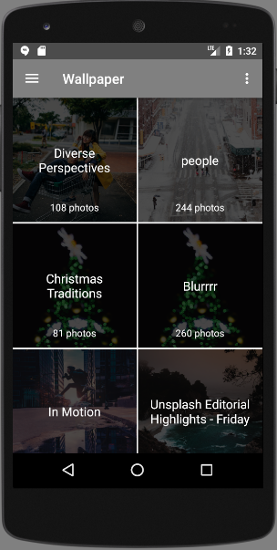
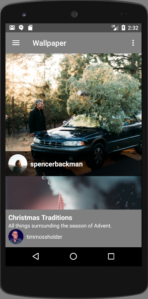
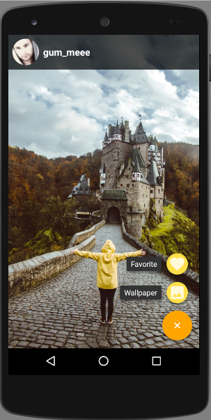

# Advanced Android: Create a Real-REST API Client Application

##### Quick Course to learn how to build a beautiful Wallpaper Android App with Retrofit, GSON, Realm, ButterKnife, Glide

## What our application looks like ?

  
  
  
  

## Requirements
- You should understand basic Java programing language
- You should have some experiences with Android (this course isn't for Android fresher)

## Description
**Every developers want to build a REAL THING, a REAL APPLICATION not just something for learning.**
In this course, you will learn how to build a real and beautiful Wallpaper Application by using Unsplash API.
And of course, you will learn how to use a lots popular Android libraries such as Retrofit, GSON, Realm, ButterKnife, Glide 4.
- If you are an Android Developer but don't know exactly how to build a REST API Client App .
- Are you an Android developer who wants to upgrade your Android skill ?
- Or you want to build a beautiful stuff.

**This is THE COURSE for you.**

With only few hours of content, this course will **CHANGE** your Android skill.
Don’t wait and enroll today. I hope to see you in my course!

**P/s: This course has ENGLISH subtitle. So don't worry !**

## Who is the target audience?

- Anyone who wants to upgrade their Android skills
- Anyone who wants to learn how to create an app using a RESTFul Web Service
- Anyone who wants to a build a modern and beautifull Android application
- This course is for intermediate and advanced application developers

#### 10$ only and refund within 30 days if you want. Please checkout [my course](https://www.udemy.com/advanced-android-development/?couponCode=ANDROID-LOVERS)
